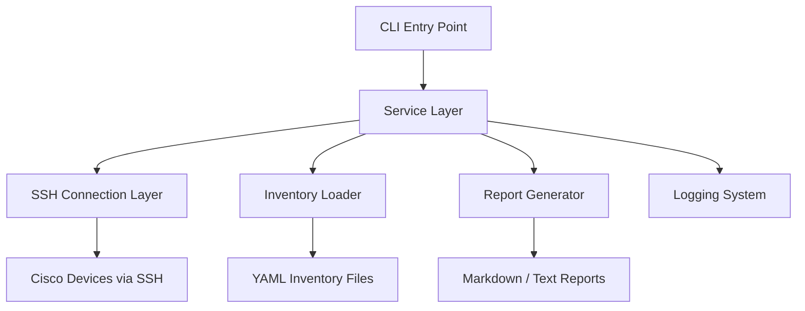

# Python Network Automation

Professional Cisco network automation project for a networking graduate portfolio.

## Current Scope

This first milestone creates the project scaffold, documentation, sample configuration files, and a minimal Python entry point. Real Cisco SSH automation will be added in the next feature after the Cisco Packet Tracer lab is designed.

## Features Planned

- Connect to Cisco devices using SSH
- Backup running configurations
- Configure VLANs
- Configure interfaces
- Run device health checks
- Generate reports
- Structured logging

## Architecture



## Setup

Create and activate a virtual environment:

```powershell
python -m venv .venv
.\.venv\Scripts\Activate.ps1
```

Install dependencies:

```powershell
pip install -r requirements.txt
```

Copy the environment template:

```powershell
Copy-Item .env.example .env
```

Run the application:

```powershell
python -m netauto.main
```

Run tests:

```powershell
pytest
```

## Docker

Build and run with Docker Compose:

```powershell
docker compose up --build
```

## Packet Tracer Lab

No real devices are configured yet. The sample inventory in `configs/inventory.example.yml` uses placeholder IP addresses that we will align with the Packet Tracer topology later.

## Troubleshooting

- If Python cannot find `netauto`, run commands from the project root directory.
- If SSH fails later, confirm the Cisco device has an IP address, SSH enabled, a local user, and reachable routing.
- Never commit `.env`; use `.env.example` for safe placeholders.

## Future Improvements

- Add Netmiko SSH connection handling
- Add configuration backup service
- Add VLAN configuration workflow
- Add interface configuration workflow
- Add health checks and report generation
- Add GitHub Actions CI
