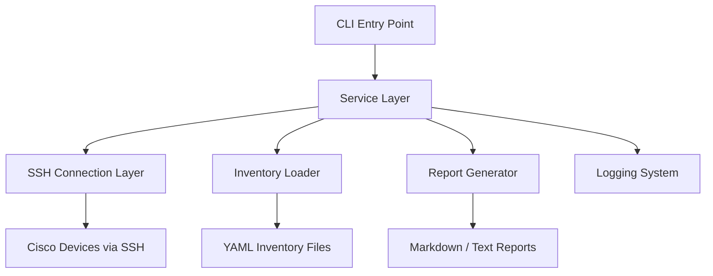

# Architecture

## Design Decisions

- The CLI is separated from the service layer so user interaction does not get mixed with network automation logic.
- SSH access will live behind a connection adapter so Netmiko-specific code is isolated.
- Inventory is stored in YAML so devices can be changed without editing Python code.
- Secrets belong in `.env`, not in Git-tracked files.
- Backups and reports are generated into dedicated folders and ignored by Git by default.
